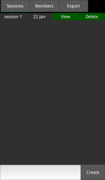
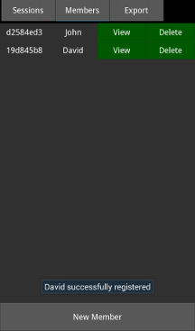
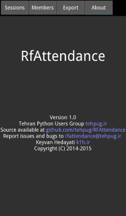

RFAttendance
===============
This app lets attendance to a session register with their RFID
tag. First they register with a tag id and a name in members tab then
you create a session and register them, you can export and import
application data in last tab.
You're android device should have NFC module, if you run app on
desktop it registers a fake NFC class which is only good for testing.

Install
========
* Download from
[Cafebazaar](http://cafebazaar.ir/app/ir.tehpug.rfattendance?l=en)

#### Or

* Clone the project:

`git clone https://github.com/tehpug/RFAttendance.git`

* Install requirements (in virtualenv):

`pip install -r requirements.txt`

* Run program on desktop:

`python main.py`

* Run on your android device in debug mode:

`buildozer --verbose android debug deploy run`

Screenshot
==========

Thanks
======
* [Fatemeh Tarashi](https://twitter.com/FatemehTarashi) for creating [splash screen](https://github.com/tehpug/RFAttendance/blob/master/resources/imgs/loading.png)
* Saber Rastikerdar for creating [icon](https://github.com/tehpug/RFAttendance/blob/master/resources/icon.png)

Licenses
==========
RfAttendance is released under the terms of the GPLv3 License. Please refer to the LICENSE file.
